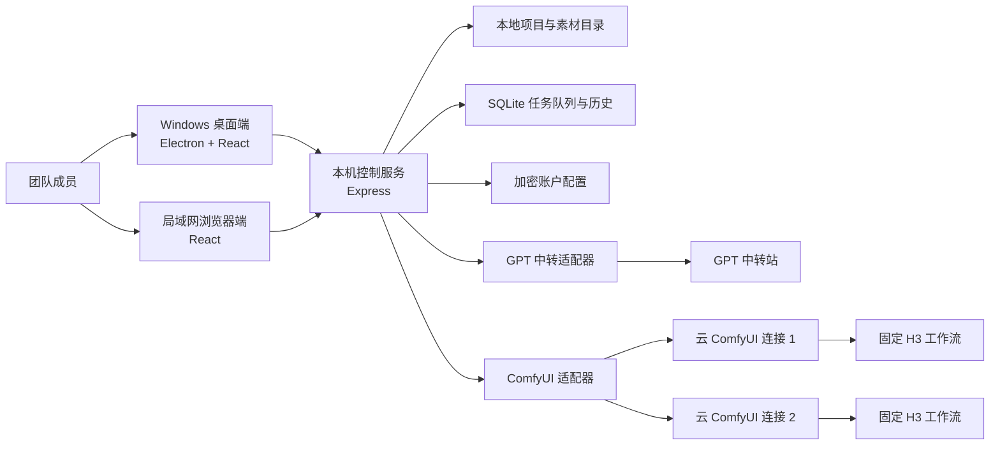
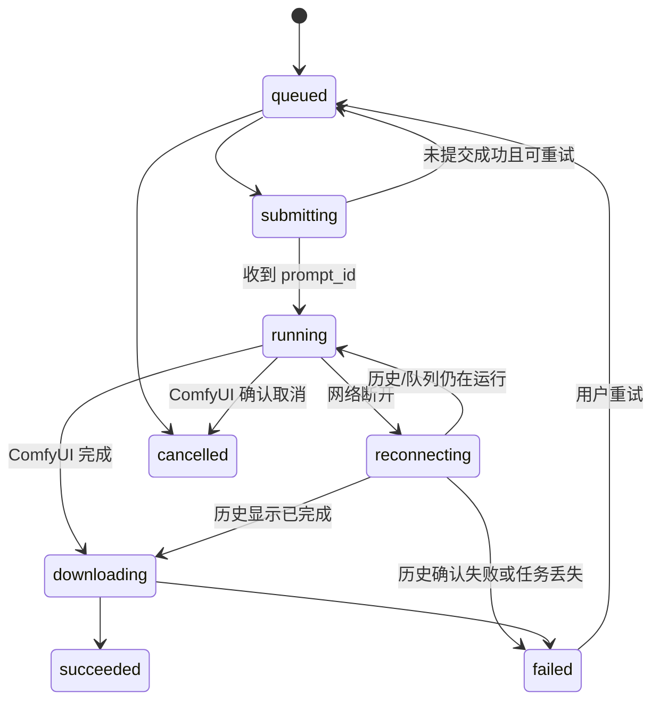

# Vela AI 生成画布：项目开发规格书（已审批）

> 文档版本：v1.0
> 日期：2026-08-06
> 审批状态：用户已于 2026-08-06 确认，可以开始实施。
> 项目代号：Vela（暂定名，短、好记；若未来商用再做商标检索）
> 基础项目：[SankaiAI/TwitCanva-Video-Workflow](https://github.com/SankaiAI/TwitCanva-Video-Workflow)
> 当前阶段：P2 已完成，等待进入 P3 GPT 中转接入。

## 1. 已确认的前提

1. 软件只供本人及内部团队使用，第一版不考虑商业化。
2. 只做 Windows 桌面端，同时提供浏览器版；浏览器版只在局域网使用。
3. 不做注册、会员、点数、订单、在线项目云同步和多人实时协作。
4. 每个人的画布、项目文件、素材、任务记录分别保存在自己的电脑上；团队只共享云端 ComfyUI 算力。
5. 第一版只接入：
   - GPT 中转接口：提示词优化和图片生成。
   - 云端 ComfyUI：运行固定、验证成功的 MiniMax H3 工作流。
6. Seedance 及其他模型保留扩展接口，但第一版界面不显示。
7. 云算力由用户在 AutoDL 或其他平台手动租用、启动和停止；Vela 只负责连接，不负责购买和启停实例。
8. 同一个 ComfyUI 连接默认串行执行；不同 ComfyUI 连接可以并行。每个连接允许人工设置最大并发，超出的任务本地排队。
9. 批量数量在模型节点内部设置。一个批次会拆成独立子任务，单条失败不影响其他条。
10. 关闭主窗口后程序缩到 Windows 系统托盘，任务继续运行。
11. 电脑关机后：
    - 已成功提交并拿到 ComfyUI `prompt_id` 的任务由云端继续运行。
    - 尚未提交的本地排队任务写入本地数据库，下次开机继续。
12. 节点只选择“账户名称/算力名称”，任何页面都不显示真实 Key。
13. 用户已于 2026-08-06 提供 LibTV 参考截图并确认高保真方向；Vela 保留自身名称和业务能力，操作界面按截图的白色无限画布、悬浮工具条和按需弹层实施。

## 2. 产品目标

Vela 是一个以无限画布为中心的 AI 图片/视频生产工具。团队成员只在前端添加节点、连线、填写创意和参数；软件负责选择账户、排队、把任务提交给 GPT 中转接口或远程 ComfyUI、同步进度、恢复断线任务，并把最终素材自动下载到本地项目。

成功不是“把 ComfyUI 嵌进软件”，而是让普通使用者不需要看到或修改 ComfyUI 工作流，也能稳定完成：

`写想法 → GPT 优化提示词/生成图片 → H3 生成视频 → 本地预览和保存`

## 3. 目标用户与典型场景

### 3.1 目标用户

- 内部运营、创意和视频生产人员。
- 会使用节点画布，但不需要理解 ComfyUI 节点或模型安装。
- 同一团队可能各自使用不同 GPT 账户，共用一个或多个云端 GPU 实例。

### 3.2 核心场景

1. 单独生成图片：提示词节点连接 GPT 图片节点，选择账户后生成 1～N 张图片。
2. 单独生成视频：提示词或上传图片连接 H3 节点，选择云算力后生成 1～N 条视频。
3. 串联生成：GPT 图片输出直接连接 H3 图生视频节点。
4. 批量生产：多个模型节点同时启动；同一 GPU 满载时排队，不同 GPU 并行。
5. 中断恢复：网络断开、软件重启或电脑重启后，使用本地任务记录和 ComfyUI 历史找回状态与输出。

## 4. 第一版范围

### 4.1 必须完成

- 中文无限画布。
- 项目新建、打开、自动保存、另存为、导入、导出。
- 节点添加、移动、连线、框选、多选、复制、删除、撤销、重做。
- 缩放、平移、小地图、自动整理、媒体拖入画布。
- 提示词节点、图片输入节点、GPT 提示词优化节点、GPT 图片节点、H3 视频节点、图片/视频结果节点。
- GPT 账户配置和账户别名选择。
- 多平台云端 ComfyUI 连接管理。
- 固定、带版本号的 H3 工作流模板。
- 本地持久队列、批量子任务、进度同步、失败提示、重试和取消。
- ComfyUI `prompt_id` 记录、断线重连、历史恢复、结果自动下载。
- 画布侧边栏形式的任务中心，不新增复杂的独立任务页面。
- Windows 桌面安装包、托盘后台运行。
- 局域网浏览器访问方式。
- API Key/令牌安全保存，节点只展示配置名称。

### 4.2 第一版明确不做

- Seedance、Kling、Veo、Fal、Gemini 等其他生成模型。
- 时间线剪辑、字幕、配音、音乐、数字人、小说转剧本。
- TikTok/X 发布和 TikTok 无水印导入。
- 注册登录、会员、点数、支付、订单。
- 项目云同步、团队素材库、实时多人协作。
- 自动购买、启动、停止或计费云 GPU。
- 在本机运行 H3 或其他重模型。
- 允许普通用户在 Vela 中编辑 ComfyUI 原始工作流。

## 5. TwitCanva 复用策略

截至 2026-08-06，目标仓库为公开项目，采用 Apache License 2.0，主项目使用 React、TypeScript、Vite 和 Express。实际实施时必须从正确仓库地址拉取，保留上游 `LICENSE` 和 `NOTICE`，并标注主要修改。

| 部分 | 决策 | 说明 |
|---|---|---|
| 无限画布、节点和连线交互 | 优先保留 | 是节省开发时间的主要价值 |
| 图片/视频预览与素材落盘思路 | 保留并整理 | 改成项目目录和统一媒体服务 |
| 工作流保存/读取 | 保留格式思想，重做存储层 | 需要自动保存、版本迁移和崩溃恢复 |
| Express API 代理 | 保留框架，拆分模块 | 不能继续把所有路由堆在单一入口 |
| 现有 GPT 调用 | 参考后改为适配器 | 要支持中转站、账户别名和可替换 Base URL |
| 现有 Hailuo API 节点 | 不作为 H3 后端 | 本项目的 H3 通过远程 ComfyUI，不走 MiniMax 商业 API |
| Gemini/Kling/Fal/社交发布/聊天 | 第一版移除或隐藏 | 缩小体积、界面和维护范围 |
| 本地开源模型/相机控制服务 | 第一版移除 | 本项目不在本机跑重模型 |
| 品牌和现有 UI | 重做 | 交互可借用，视觉和信息结构按 Vela 重新设计 |

实施开始后的第一个技术任务必须是源码审计：确认画布是否足够模块化、节点状态与 API 调用耦合程度、已有测试情况。若改造成本超过重写画布外壳，则保留交互算法和数据结构，不强行保留旧页面。

## 6. 总体架构



### 6.1 为什么桌面端选 Electron

TwitCanva 已是 React + Node/Express。Electron 可以直接复用这套技术，并原生支持 Windows 安装包、托盘、开机恢复、本地文件系统和后台服务。Tauri 会降低部分内存，但会引入 Rust、IPC 重写和双语言维护，第一版不划算。

### 6.2 三层职责

#### 画布前端

- 只负责交互、参数编辑、预览、状态展示。
- 不保存真实 Key，不直接调用外部模型。
- 节点向本机控制服务提交统一的生成请求。

#### 本机控制服务

- 保存项目、素材、账户别名和任务记录。
- 根据节点类型调用不同模型适配器。
- 负责队列、并发、WebSocket/SSE 进度、断线恢复和自动下载。
- 桌面窗口关闭后继续运行。

#### 外部模型/云算力

- GPT 中转站负责提示词和图片。
- 云端 ComfyUI 负责 H3 视频。
- 云平台只要能提供稳定的 ComfyUI HTTP(S) 和 WebSocket 地址，就可接入；不把 AutoDL 等平台规则写死在核心代码中。

## 7. 技术栈

### 7.1 继承上游

- React + TypeScript + Vite。
- Express 作为本机控制服务。
- Lucide 图标和现有画布交互代码。

版本策略：实施时以审计后的上游 `package-lock.json` 为基线冻结版本，不在“接入 ComfyUI”的同时做无关的大版本升级。

### 7.2 计划新增

- Electron：Windows 外壳、托盘和本地服务生命周期。
- electron-builder：Windows 安装包。
- SQLite（建议 `better-sqlite3`）：任务、批次、连接和迁移记录。
- Zod：前后端请求、工作流参数和配置校验。
- Vitest + Testing Library：单元和组件测试。
- Playwright：桌面/Web 核心流程测试。
- Pino：结构化本地日志，自动脱敏。

是否采用新的画布库、状态库或 UI 组件库，必须先做源码审计并征得确认；第一版原则是少换依赖。

## 8. 目标项目结构

```text
vela/
├─ apps/
│  ├─ web/                    # React 画布前端，桌面和浏览器共用
│  └─ desktop/                # Electron 主进程、托盘、安装包
├─ server/
│  ├─ api/                    # 项目、任务、连接、账户 API
│  ├─ providers/              # GPT、ComfyUI、未来 Seedance 适配器
│  ├─ queue/                  # 调度、并发、恢复、重试
│  ├─ workflows/h3/           # 固定 H3 工作流 JSON 与映射器
│  ├─ storage/                # SQLite、项目文件、媒体下载
│  └─ security/               # 凭据加密、脱敏、局域网访问保护
├─ packages/
│  ├─ contracts/              # 前后端共享类型与 Zod Schema
│  ├─ canvas-core/            # 可复用画布与节点基础能力
│  └─ ui/                     # Vela UI 组件和设计令牌
├─ tests/
│  ├─ fixtures/               # 模拟 GPT/ComfyUI 响应与工作流
│  ├─ integration/            # 服务集成测试
│  └─ e2e/                    # 桌面/Web 端到端测试
├─ docs/                      # 规格、运维、工作流和使用手册
├─ tasks/                     # 实施计划与任务清单
├─ LICENSE                    # 保留 Apache-2.0
└─ NOTICE                     # 保留上游声明并补充修改说明
```

第一阶段允许保留上游目录，按功能逐步迁移，禁止一次性“大重构”导致所有功能同时失效。

## 9. 节点系统

### 9.1 第一版节点

| 节点 | 输入 | 输出 | 核心配置 |
|---|---|---|---|
| 提示词 | 无 | 文本 | 正向/负向提示词、备注 |
| 图片输入 | 本地文件/拖入 | 图片 | 裁切仅预览，不破坏原图 |
| GPT 提示词优化 | 文本、可选图片 | 文本 | 账户名称、系统模板、优化目标 |
| GPT 图片 | 文本、可选参考图 | 图片组 | 账户名称、模型名、比例、数量 |
| H3 视频 | 文本、可选首帧/尾帧 | 视频组 | 算力名称、模式、比例、分辨率、时长、Seed、音频、数量 |
| 图片结果 | 图片 | 图片 | 预览、下载、在资源管理器中显示 |
| 视频结果 | 视频 | 视频 | 播放、下载、在资源管理器中显示、送入后续节点 |

“H3 视频”先以一个节点呈现，根据输入自动切换文生视频、图生视频或首尾帧模式；如果真实工作流的参数差别过大，再拆成多个节点。

### 9.2 端口类型

- `TEXT`
- `IMAGE`
- `VIDEO`
- `IMAGE_LIST`
- `VIDEO_LIST`

不兼容的端口不能连接。连接被拒绝时明确提示，例如：“H3 的首帧输入只接受图片”。

### 9.3 批量生成

- 节点内填写数量，建议快捷值：1、4、10、20，也允许输入合法整数。
- 服务端设安全上限，第一版默认单节点最多 50 个子任务，可在设置中调整。
- 每个子任务有自己的 ID、Seed、进度、重试次数和输出。
- 批次显示 `已完成/总数`；可以只重试失败项。
- Seed 模式：固定、递增、随机。

## 10. GPT 适配器

由于中转站文档、Base URL 和真实模型名尚未提供，第一版先定义统一接口，不把某家中转协议写进节点组件。

```ts
export interface ImageProvider {
  testConnection(profileId: string): Promise<ConnectionTestResult>;
  optimizePrompt(input: OptimizePromptInput): Promise<OptimizedPrompt>;
  generateImage(input: GenerateImageInput): Promise<GeneratedAsset[]>;
}
```

账户配置字段：

- 显示名称，例如“团队 GPT”“我的 GPT”“备用 GPT”。
- Base URL。
- Key/Token（加密保存，保存后不可明文查看）。
- 模型名映射。
- 额外请求头（白名单方式配置）。
- 超时和重试次数。
- “测试连接”按钮。

节点只保存 `profileId`，不保存 Key。更换 Key 不需要修改旧项目。

## 11. 云端 ComfyUI 连接管理

### 11.1 连接配置

每个连接保存：

- 名称，例如“AutoDL 5090”“48G 云算力 2”。
- ComfyUI Base URL。
- WebSocket URL（默认由 Base URL 推导）。
- 鉴权方式：无、Bearer Token、Basic Auth、自定义白名单请求头。
- 最大并发数，默认 1。
- H3 工作流版本。
- 连接标签、备注。
- 可选的远程输出保留说明。

### 11.2 连接状态

- 未配置。
- 正在检测。
- 在线空闲。
- 在线忙碌。
- 队列已满。
- 断线重连。
- 鉴权失败。
- 工作流不兼容。

连接测试至少检查：HTTP 可达、WebSocket 可达、`/system_stats`、`/queue`、工作流需要的节点类型和模型文件是否存在。最后一项需要一个专用“环境自检工作流”或对象信息检查，不能只看到首页就显示“可用”。

### 11.3 多平台原则

核心代码只依赖标准 ComfyUI API，不依赖 AutoDL、RunPod 或其他平台 SDK。平台差异放在连接预设中，例如 URL 模板、认证头和使用说明。这样更换租赁平台不需要改节点或项目文件。

## 12. 固定 H3 工作流

### 12.1 工作流管理

- 每套工作流为只读 JSON 模板，带 `workflowId` 和语义化版本号。
- 建议至少准备：`h3-t2v`、`h3-i2v`、`h3-first-last-frame`。
- 参数映射器只替换白名单字段，不允许用户输入任意节点 ID。
- 启动时校验工作流哈希和必需模型。
- 项目任务记录所使用的工作流版本，便于以后恢复。

### 12.2 参数能力

计划支持：文生视频、图生视频、首尾帧、9:16/16:9/1:1、720p/1080p、5/10/15 秒、Seed、正负提示词和原生音频。

这里是“目标能力”，不是无条件承诺。实施前必须用最终 H3 模型和工作流逐项验证。工作流不支持的组合在 UI 中自动禁用，不能把无效参数提交后才报错。

## 13. 任务队列与断线恢复

### 13.1 任务状态机



### 13.2 调度规则

1. 每个算力连接有独立队列和并发槽。
2. 同一连接默认并发 1；多个连接互不阻塞。
3. 节点可选择具体算力连接；第一版不做自动迁移，避免不同实例模型不一致。
4. 连接离线时任务保持“等待算力”，不直接失败。
5. 提交成功后立即保存 `prompt_id`、连接 ID、工作流版本和时间。
6. 运行中断线时禁止盲目重新提交，先查 `/queue` 和 `/history/{prompt_id}`，避免生成重复视频。

### 13.3 软件/电脑重启

- 本地队列和状态每次变化都写入 SQLite。
- 桌面应用启动后先恢复 `queued/submitting/running/reconnecting/downloading` 状态。
- 有 `prompt_id`：查询 ComfyUI 队列和历史，继续监控或下载。
- 无 `prompt_id`：仍视为本地待提交任务。
- 云端实例已经被释放且历史不可访问：标记“无法从原算力恢复”，保留完整参数，允许用户连接新实例后手动重新生成。

### 13.4 进度真实性

ComfyUI 能提供节点执行进度时显示百分比；不能提供时显示“排队中/加载模型/生成中/保存中/下载中”，不伪造线性百分比。批量进度按完成子任务数计算。

## 14. 本地存储

### 14.1 项目目录

```text
Vela Projects/项目名/
├─ project.json               # 节点、连线、视图和配置引用
├─ assets/                    # 用户导入素材
├─ outputs/images/            # 生成图片
├─ outputs/videos/            # 生成视频
├─ thumbnails/                # 缩略图缓存
└─ exports/                   # 手动导出包
```

任务中心数据库、应用配置和日志放在 Windows 用户应用数据目录，不与某个项目绑定。项目文件只引用账户/算力配置 ID，不包含秘密。

### 14.2 自动保存与导出

- 画布修改后 2 秒防抖自动保存。
- 每次保存使用临时文件 + 原子替换，避免断电产生半个 JSON。
- 保留最近 20 个轻量项目快照，不复制大视频。
- 导出为 `.vela` 压缩包时，允许选择“只含工作流”或“包含全部素材”。

### 14.3 云端备份边界

Vela 会尽快把结果下载到本地，并在任务中保存远程文件引用。云端能保留多久取决于租赁平台磁盘和实例生命周期，Vela 不能保证固定天数。第一版不主动删除云端输出；用户释放实例前应确认本地下载完成。

## 15. 凭据和局域网安全

- 桌面端使用 Electron `safeStorage`/Windows DPAPI 加密敏感值。
- 日志、错误弹窗、项目文件和导出包禁止写入完整 Key。
- Key 保存后只显示账户名称和“已配置”，修改时重新输入。
- 浏览器不直连 GPT/ComfyUI，统一经过本机控制服务，避免 Key 暴露在前端。
- 局域网服务默认只监听本机；用户开启“允许局域网访问”后才监听 LAN 地址。
- 开启 LAN 访问时使用一个简单访问密码和会话 Cookie。后续若暴露到公网，必须另做 HTTPS、反向代理和更强认证，不属于第一版。
- 自定义请求头只允许配置明确白名单，禁止注入 `Host` 等危险头。

## 16. API 草案

### 16.1 项目

- `GET /api/projects`
- `POST /api/projects`
- `GET /api/projects/:id`
- `PUT /api/projects/:id`
- `POST /api/projects/:id/import`
- `POST /api/projects/:id/export`

### 16.2 账户与算力

- `GET /api/profiles?type=gpt|comfy`
- `POST /api/profiles`
- `PATCH /api/profiles/:id`
- `DELETE /api/profiles/:id`
- `POST /api/profiles/:id/test`
- `GET /api/comfy/:id/status`

所有读取接口只返回脱敏后的配置。

### 16.3 任务

- `POST /api/jobs`
- `GET /api/jobs`
- `GET /api/jobs/:id`
- `POST /api/jobs/:id/retry`
- `POST /api/jobs/:id/cancel`
- `POST /api/job-groups/:id/retry-failed`
- `GET /api/events`：SSE 或 WebSocket 状态推送。

### 16.4 媒体

- `POST /api/assets/import`
- `GET /api/assets/:id`
- `GET /api/assets/:id/file`
- `POST /api/assets/:id/reveal`

## 17. LibTV 参考高保真 UI 设计

### 17.1 设计方向

主题改为“安静的白色无限画布”。核心是画布和生成流；项目、素材、任务、算力只在用户点击后以悬浮卡片、抽屉或大弹层出现，默认不占用左右侧栏。

根据用户提供的 LibTV 截图冻结第一版视觉令牌：

- `Canvas` `#F8F8F7`：主背景。
- `Surface` `#FFFFFF`：控件、节点输入区和弹层。
- `Ink` `#171717`：主文字和主操作。
- `Muted` `#767676`：说明、尺寸和次级状态。
- `Hairline` `#E5E5E3`：细边框与连线。
- `Signal Blue` `#00A9D6`：在线、远程执行和进度状态。
- 中文正文：`Noto Sans SC` / `Microsoft YaHei UI`。
- 数据、Seed、时长：`JetBrains Mono`。

标志性交互仍是“任务轨迹”：运行中的连接线上只出现一条克制的方向脉冲，节点边缘同时显示真实阶段；颜色只表达状态，不作为装饰。画布其余区域保持安静。阴影只用于悬浮控件和弹层，节点本体主要使用 1px 灰色描边。

### 17.2 主画布

```text
┌──────────────────────────────────────────────────────────────────────────────┐
│ Vela  项目：夏季带货  已自动保存       撤销 重做     算力●2/2   任务  设置 │
├───────┬───────────────────────────────────────────────────────┬──────────────┤
│ 节点  │                                                       │ 属性         │
│       │   ┌──────────┐       ┌────────────┐                  │ 节点：H3视频  │
│ 文本  │   │ 提示词   │──────▶│ GPT 图片   │                  │ 模式：图生视频│
│ 图片  │   └──────────┘       │ 完成 4/4   │                  │ 算力：云端01  │
│ GPT   │                       └─────┬──────┘                  │ 比例：9:16    │
│ H3    │                             │                         │ 1080p / 15秒  │
│ 结果  │                             ▼                         │ 数量：10      │
│       │                       ┌────────────┐                  │ Seed：随机    │
│ 资源  │                       │ H3 视频    │                  │ [开始生成]    │
│       │                       │ 排队 2/10  │                  │              │
│       │                       └────────────┘                  │              │
│       │                                  [小地图]             │              │
├───────┴───────────────────────────────────────────────────────┴──────────────┤
│ 任务中心 ▸  运行 2  排队 8  失败 0        下载完成后自动保存到本项目        │
└──────────────────────────────────────────────────────────────────────────────┘
```

交互规则：

- 左上角是工作区胶囊：Vela 标识、项目名和当前画布。
- 右上角保留算力、任务和保存入口，不显示会员、点数或 Agent。
- 底部中央是悬浮工具条：添加、选择、连线、素材、整理、任务、快捷键和帮助。
- 点击“添加”出现与参考图同层级的纵向节点菜单，不设常驻左侧节点栏。
- 中央画布始终占最大空间。
- 当前节点参数优先放在节点下方的生成输入条；账户、数量等低频参数按需弹出，不设置常驻右侧属性栏。
- 顶部“算力”显示在线/忙碌数量，点击打开连接管理抽屉。
- 底部任务中心默认收起，只显示数字；展开后覆盖画布底部，不跳转页面。
- 项目、历史素材和快捷键使用大尺寸白色弹层；背景加半透明黑色遮罩。

### 17.3 任务中心抽屉

```text
┌ 任务中心 ────────────────────────────────────────────────────────────────┐
│ 全部 18   运行 2   排队 8   已完成 7   失败 1              [只看本项目] │
├──────────────────────────────────────────────────────────────────────────┤
│ ● H3 批次 #21  4/10   云端01   当前：采样 37%        [暂停排队] [详情] │
│ ○ GPT 图片 #20  等待  团队GPT  前方 3 个任务          [取消]             │
│ ✓ H3 视频 #19  完成   云端02   已下载                   [打开文件]         │
│ ! H3 视频 #18  失败   云端01   缺少模型文件            [查看原因] [重试] │
└──────────────────────────────────────────────────────────────────────────┘
```

详情显示：来源节点、批次、参数摘要、提交时间、`prompt_id` 后 8 位、工作流版本、远程/本地文件状态和可执行动作。默认不展示调试 JSON。

### 17.4 算力连接管理

```text
┌ 算力连接管理 ─────────────────────────────────────────────────────────┐
│ AutoDL 5090   ● 在线忙碌   1/1   队列 6   H3 v1.2    [检测] [编辑] │
│ 48G 云算力2   ● 在线空闲   0/2   队列 0   H3 v1.2    [检测] [编辑] │
│ 备用实例      ○ 已断开     --    等待重连               [连接]        │
│                                                           [+ 添加连接]│
└───────────────────────────────────────────────────────────────────────┘
```

添加/编辑连接只要求用户认识“平台给我的地址、令牌、最大并发”。高级配置折叠，不把 ComfyUI 节点或工作流暴露给普通用户。

### 17.5 账户配置

```text
┌ 模型账户 ──────────────────────────────────────────────────────────────┐
│ 团队 GPT   GPT 中转   已配置   上次检测成功                 [测试] [编辑]│
│ 我的 GPT   GPT 中转   已配置   尚未检测                     [测试] [编辑]│
│ 备用 GPT   GPT 中转   未配置                               [配置]       │
└───────────────────────────────────────────────────────────────────────┘
```

### 17.6 空状态和错误文案

- 空画布：“拖入一张图片，或从左侧添加第一个节点。”
- 无算力：“还没有可用算力。添加 ComfyUI 连接后才能生成 H3 视频。”
- 断线：“云端01 已断开。已提交任务不会重复发送，恢复连接后继续查询。”
- 缺模型：“连接成功，但 H3 工作流缺少 2 个模型文件。查看环境检查结果。”
- 下载失败：“云端生成已完成，本地下载失败。远程结果仍可用，点击重新下载。”

### 17.7 高保真参考与边界

视觉真值为用户于 2026-08-06 提供的 9 张 LibTV 截图，覆盖主画布、添加菜单、素材工具箱、角色库、历史资产、快捷键、文本节点、图片节点和添加节点菜单。Vela 模仿其操作布局、密度、圆角、阴影、字体层级和弹层行为，但不复制 LibTV 商标、会员、点数、Agent 或未进入第一版范围的业务；任务恢复和算力状态仍必须可见。

## 18. 桌面端与浏览器端行为

### 18.1 Windows 桌面端

- 安装后启动本机控制服务和画布窗口。
- 关闭窗口默认缩到托盘；托盘菜单提供“打开 Vela、任务中心、暂停本地队列、完全退出”。
- 有排队/运行任务时选择“完全退出”需要明确确认。
- 可选开机启动，默认关闭。

### 18.2 局域网浏览器端

- 由每台电脑自己的 Vela 控制服务提供页面，项目仍保存在该电脑。
- 默认只能 `localhost` 访问；用户手动开启局域网访问后，同一局域网浏览器可通过该电脑 IP 访问。
- 浏览器关闭不会停止本机控制服务。
- 第一版不保证手机端完整编辑，只保证现代 Windows 桌面浏览器。

## 19. 性能和电脑占用目标

本项目不在本机加载 H3 模型，本机主要承担 Electron、画布、网络传输、视频预览和文件下载。

验收目标（需要真实构建后实测）：

- 桌面端空闲内存目标小于 800 MB；打开中型项目目标小于 1.5 GB，不含操作系统视频解码缓存。
- 空闲 CPU 平均小于 3%。
- 前端自身 GPU 显存目标小于 1 GB；云端生成不持续占用本机 CUDA。
- 200 个普通节点的画布缩放/拖动目标 45 FPS 以上。
- 安装包与应用文件目标小于 1 GB；硬盘主要消耗来自图片和视频输出。
- 提供缓存上限和“清理缩略图/临时下载”功能，不能删除原始项目输出。

这些是工程验收线，不是现阶段已经验证的成绩。

## 20. 命令约定

上游当前基础命令：

```powershell
npm ci
npm run dev
npm run build
```

Vela 目标命令（实施任务中补齐脚本）：

```powershell
npm ci
npm run dev
npm run dev:web
npm run dev:desktop
npm run typecheck
npm run lint
npm run test -- --run
npm run test:integration -- --run
npm run test:e2e
npm run build:web
npm run build:win
```

任何版本发布前至少执行 `typecheck`、`lint`、全部测试、Web 构建和 Windows 构建。

## 21. 代码风格

- TypeScript 开启严格模式，禁止在业务边界使用未校验的 `any`。
- 组件使用 `PascalCase`；函数、变量、文件夹使用清晰英文；界面文案集中管理，禁止散落硬编码。
- API、数据库和外部响应必须先通过 Schema 校验。
- Provider、队列和存储通过接口解耦，节点组件不能直接调用 `fetch`。
- 单文件建议不超过 300 行；超过时按职责拆分。

示例：

```ts
const submitJob = async (input: SubmitJobInput): Promise<JobRecord> => {
  const request = SubmitJobSchema.parse(input);
  const profile = await profileStore.getRequired(request.profileId);
  return jobQueue.enqueue({ request, profile });
};
```

## 22. 测试策略

### 22.1 单元测试

- 节点输入/输出兼容规则。
- H3 工作流参数映射和参数禁用规则。
- 批量任务展开、Seed 策略、并发调度。
- 状态机和重试判定。
- 配置脱敏和日志脱敏。

### 22.2 集成测试

- 使用假的 GPT 服务测试成功、限流、超时、断流和返回格式错误。
- 使用假的 ComfyUI HTTP/WebSocket 服务测试提交、进度、历史、取消和结果下载。
- SQLite 崩溃恢复和数据库迁移。
- 项目自动保存、损坏文件回退和导入导出。

### 22.3 端到端测试

- 新建项目 → GPT 图片 → 自动保存。
- 图片连接 H3 → 云端生成 → 结果下载。
- 20 条批量任务在单连接上排队。
- 两个 ComfyUI 连接并行执行。
- 运行中关闭窗口，托盘继续。
- 运行中重启应用，通过 `prompt_id` 恢复。
- 任务完成但下载失败，重新下载成功。
- Key 不出现在 UI、日志、项目和导出包中。

### 22.4 真机验收

- 一台团队常用 Windows 电脑。
- 一个 24 GB 云 GPU 实例和一个 48 GB 云 GPU 实例。
- 最终 GPT 中转账户。
- 最终 H3 工作流、模型文件和 9:16 测试素材。

## 23. 验收标准

第一版只有同时满足以下条件才算完成：

1. 用户不打开 ComfyUI 页面，也能在 Vela 完成 GPT 图片和 H3 视频生成。
2. 节点可以独立运行，也能完成 `GPT 图片 → H3 视频` 串联。
3. 单节点可设置生成数量，批次状态和每个子任务可追踪。
4. 同一算力按设置并发，多个算力并行，超出部分稳定排队。
5. 关闭主窗口后任务继续；重启软件后未提交任务恢复。
6. 对已提交 H3 任务，保存 `prompt_id` 并能从 ComfyUI 历史恢复结果。
7. 所有成功结果自动下载到当前项目；下载失败可单独重试。
8. 每个人的项目和素材保存在自己的电脑，不建立项目云服务。
9. 节点只展示账户/算力名称，真实 Key 不进入画布、项目、日志或导出包。
10. H3 参数只允许提交经工作流验证的组合。
11. Windows 安装包可安装、更新和卸载；浏览器可在启用后通过局域网访问。
12. 完成性能基线测试，达到第 19 节目标或提交明确的差异和优化决定。

## 24. 风险与处理

| 风险 | 影响 | 处理方式 |
|---|---|---|
| TwitCanva 代码耦合较重 | 改一个模型影响多个节点 | 第一周做审计和最小原型，先抽 Provider 接口 |
| H3 工作流/模型仍变化 | 参数、显存和输出不稳定 | 固定模型文件、工作流哈希和版本，不追最新版 |
| 云平台地址或隧道断开 | 前端失去实时进度 | 保存 `prompt_id`，WebSocket + HTTP 历史双通道恢复 |
| 云实例被释放 | 历史和输出丢失 | 完成后立即下载；释放实例前显示未下载数量 |
| 中转站协议不兼容 OpenAI | GPT 节点无法直接复用 | 单独 Provider 适配器，拿到文档后做契约测试 |
| Electron 内存偏高 | 低配电脑体验受影响 | 单窗口、懒加载媒体、缩略图、虚拟化、性能预算 |
| 批量任务重复提交 | 浪费算力 | 本地 job ID + `prompt_id`，断线先查历史，不盲目重试 |
| Key 泄露 | 团队账户受损 | 后端代理、DPAPI、日志脱敏、导出扫描测试 |

## 25. 开发边界

### 始终执行

- 先更新规格，再改变范围或任务状态机。
- 每次 Provider 改动使用模拟服务测试错误路径。
- 提交前运行类型检查、测试和构建。
- 保留 Apache-2.0 `LICENSE`、`NOTICE` 和修改说明。
- 所有外部输入和工作流参数必须校验。

### 必须先问

- 更换画布库、Electron 或数据库。
- 新增模型、云平台专属控制、云端项目服务。
- 改变本地文件格式或做不可逆数据库迁移。
- 自动删除本地/云端素材。
- 加入自动更新、代码签名或收费功能。

### 永远不做

- 把 Key 写进前端包、项目文件、Git 或日志。
- 断线时无条件重复提交正在运行的任务。
- 未验证工作流就向团队发布 H3 参数。
- 为了通过测试删除失败测试或吞掉错误。
- 未经确认修改/删除现有 `velorn-zh-CN` 项目。

## 26. 尚待补充但不阻塞架构的资料

开始对应功能前再提供即可：

1. GPT 中转站 API 文档、Base URL、鉴权方式和模型名。
2. 最终 H3 ComfyUI 工作流 API JSON。
3. H3 模型文件清单、ComfyUI 版本和自定义节点清单。
4. 计划使用的云平台连接方式示例。
5. LibTV 的布局、节点、任务状态和设置页面截图。

## 27. 大白话总结

### 这个项目怎么制作

先把 TwitCanva 里有价值的“画布、节点、连线、图片视频预览”留下，把不需要的模型、社交发布和本地重模型删掉。然后加一个本机后台：它保存项目、账户和任务，替你把 GPT 请求发给中转站，把 H3 请求转换成固定 ComfyUI 工作流发到云 GPU。最后加上队列、断线恢复、自动下载、Windows 托盘和局域网网页。

### 软件做完后怎么使用

1. 你先在云平台租 GPU，启动配置好 H3 的 ComfyUI。
2. 在 Vela 的“算力连接”里填地址和令牌，点一次检测。
3. 在“模型账户”里配置 GPT 中转账户，只给它起一个名称。
4. 回到画布拖入提示词、GPT 图片或 H3 视频节点，连线并选择账户/算力名称。
5. 设好比例、时长、数量后点生成。你可以继续做别的，后台自动排队、同步、下载。

### 软件内部怎么运作

你点“生成”后，前端只把节点参数交给本机后台。本机后台先把任务写入数据库，再看选中的 GPT 或 ComfyUI 是否有空位。有空位就提交，没有就排队。H3 提交成功后保存云端 `prompt_id`；即使界面关闭或网络短暂断开，也能再去 ComfyUI 历史里找任务。云端完成后，后台把视频下载到当前项目，画布节点自动出现结果。重活都在云 GPU 上，本机只做控制、显示和保存文件。

## 28. 审批记录

用户已于 2026-08-06 回复“规格确认，可以开始”。项目进入 P0；后续仍按里程碑门禁评审，不提前扩大范围。
