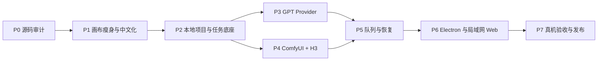

# Vela 第一版实施计划（已审批，P2 已完成）

> 依赖规格：`docs/VELA_PROJECT_SPEC.md` v0.1
> 状态：规格与继续改造路线已批准，P0、P1、P2 已完成。
> 目标：基于 TwitCanva 构建 Windows + 局域网 Web 的 AI 无限画布，第一版接入 GPT 中转与云端 ComfyUI H3。

## 1. 交付路线

P3 和 P4 在公共 Provider 契约完成后可以并行，其余阶段按依赖顺序推进。

## 2. 阶段计划

### P0：源码冻结与可行性审计

目标：证明 TwitCanva 的画布值得复用，并得到真实改造清单。

工作：

- 从正确仓库地址创建内部 fork/工作分支。
- 保存上游提交号，核对 `LICENSE`、`NOTICE` 和依赖许可证。
- 跑通现有开发和构建命令。
- 画出画布、节点状态、API、素材、工作流存储之间的依赖图。
- 统计需保留、隐藏、删除、重写的模块。
- 做一个不调用模型的“提示词 → 假图片结果”纵向原型。

检查点：

- TwitCanva 原版能本地构建。
- 画布可在不依赖 Gemini/Kling/Hailuo/Fal 的情况下运行。
- 给出“继续改造”或“保留算法、重写外壳”的明确结论。

预计：3～5 个工作日。

### P1：Vela 画布外壳与第一版节点

目标：得到可保存的中文画布，不接真实模型。

工作：

- 替换品牌和中文文案，建立统一文案目录。
- 移除/隐藏第一版范围外功能。
- 整理节点基础类、端口类型、连线校验和结果展示。
- 完成提示词、图片输入、GPT 优化、GPT 图片、H3 视频、图片结果、视频结果节点壳。
- 完成多选、复制、删除、撤销/重做、小地图、自动整理、拖入媒体。
- 落地低保真主画布、属性栏、任务抽屉和算力抽屉结构。

检查点：

- 可用假数据完成 `提示词 → GPT 图片 → H3 视频` 连线。
- 200 个假节点完成基础性能测试。
- 所有第一版外功能从普通用户入口消失。

预计：7～10 个工作日。

### P2：本地项目、任务数据库和公共契约

目标：应用重启后项目和任务不丢，为真实 Provider 提供稳定底座。

工作：

- 定义项目、节点、媒体、账户、算力、任务、批次的数据 Schema。
- 实现项目目录、原子自动保存、快照、导入和导出。
- 引入 SQLite，建立迁移和任务状态机。
- 建立 Provider 接口、统一错误类型和事件推送。
- 实现批量子任务、Seed 策略、每连接并发槽和基本调度。
- 建立结构化日志、日志脱敏和诊断包。

检查点：

- 强制结束进程后项目可恢复到最近自动保存。
- 50 个假任务重启后顺序、状态和批次不变。
- 项目、日志和导出包秘密扫描为零。

预计：8～12 个工作日。

### P3：GPT 中转接入

前置：用户提供 GPT 中转站文档和测试账户。

当前状态（2026-08-06）：已确认 YMAN 的 OpenAI 兼容基址为 `https://api.yman.cc/v1`，Profile、安全存储、连接测试、提示词优化、图片生成/编辑、本地下载和安全重试均已实现并通过模拟测试。仍缺 API Key 与实际模型名，因此真接口提示词和生图验收尚未完成。

目标：提示词优化和图片生成可用，节点只选择账户名称。

工作：

- 实现 GPT Profile、安全存储、脱敏读写和连接测试。
- 按中转站契约实现提示词优化与图片生成。
- 支持 Base URL、模型映射、超时、限流、重试和返回格式校验。
- 下载图片到项目并建立媒体记录。
- 接入节点、任务中心和错误文案。

检查点：

- 三个账户别名可切换，节点/日志看不到 Key。
- 单图、参考图和批量生成通过真接口测试。
- 限流、超时和服务错误不会造成重复扣费式提交。

预计：4～6 个工作日（不含中转站问题等待时间）。

### P4：多平台 ComfyUI 与固定 H3 工作流

前置：用户提供最终 H3 工作流 API JSON、模型和自定义节点清单、至少一个测试实例。

目标：连接任意标准 ComfyUI 地址并完成真实 H3 生成。

工作：

- 实现 ComfyUI HTTP/WebSocket 客户端。
- 实现连接 Profile、鉴权、最大并发和状态检测。
- 实现环境自检：ComfyUI、节点类型、模型、队列和工作流版本。
- 固化并版本化 H3 工作流；实现白名单参数映射。
- 上传输入图、提交 `/prompt`、监听进度、查询 `/queue` 和 `/history`。
- 下载结果到本地并校验文件完整性。
- 用真实工作流逐项验证模式、比例、分辨率、时长、Seed、音频和首尾帧能力。

检查点：

- 24 GB 和 48 GB 测试实例至少各跑通一个 9:16 用例。
- 不打开 ComfyUI 页面即可完成提交、进度和下载。
- 工作流不支持的参数在提交前被禁用。

预计：10～15 个工作日，实际取决于工作流稳定性和单条视频耗时。

### P5：可靠队列、批量和断线恢复

目标：把“能生成”提升为“能放心批量生成”。

工作：

- 完成同连接限流、多连接并行、离线等待和公平调度。
- 提交成功后原子保存 `prompt_id`，加入幂等/去重保护。
- WebSocket 断开时用 ComfyUI 队列和历史恢复。
- 完成软件重启、电脑重启、下载失败和云实例释放场景。
- 完成批次进度、失败项重试、取消、重新下载。
- 增加“释放云实例前检查未下载结果”。

检查点：

- 20 条任务单连接排队无丢失、无重复。
- 两个连接可并行，互不阻塞。
- 生成中断网、关闭窗口、重启应用后都能恢复或给出可操作结论。

预计：7～10 个工作日。

### P6：Windows 桌面端与局域网 Web

目标：普通成员可安装、托盘运行和通过 LAN 使用。

当前状态（2026-08-06）：因用户要求优先解决打开方式，提前完成 Electron 桌面 Alpha、单实例、随机端口内置服务、托盘和 NSIS 安装包，并已安装到当前电脑。LibTV 高保真白色无限画布 UI 已完成实现和同屏视觉复检；DPAPI、LAN 开关、带真实任务的托盘退出确认和干净 Windows 安装矩阵仍按 P6 后续任务继续。

工作：

- Electron 启动/停止本机服务，建立单实例锁和端口管理。
- 主窗口关闭改为托盘运行；完全退出做任务确认。
- 打包 Windows 安装程序，处理数据目录和卸载保留策略。
- 实现“允许局域网访问”开关、访问密码和会话。
- 浏览器与桌面共享同一套 React 前端和 API 契约。
- 按 LibTV 截图重构白色无限画布、悬浮控件、节点输入条和管理弹层，同时保留 Vela 品牌与业务范围。
- 完成离线启动、端口冲突、防火墙提示和更新说明。

检查点：

- 安装版在干净 Windows 环境启动。
- 窗口关闭后任务继续，托盘可恢复窗口。
- 同一局域网另一台电脑通过密码打开 Web 页面。

预计：7～10 个工作日。

### P7：真机验收、性能优化和内部发布

目标：达到规格验收线并交付团队使用。

工作：

- 执行单元、集成、E2E 和真机验收矩阵。
- 测量内存、CPU、GPU 显存、画布 FPS、安装包和缓存。
- 优化视频懒加载、缩略图、任务列表虚拟化和资源回收。
- 编写安装、云端连接、H3 环境、使用、排错和备份手册。
- 制作内部版本号、变更日志和回滚包。
- 高保真 UI 使用用户已提供的 LibTV 截图作为视觉真值，完成同视口对照后进入验收。

检查点：

- `docs/VELA_PROJECT_SPEC.md` 第 23 节全部通过或有用户批准的差异。
- 团队试用至少完成一轮真实批量项目。
- 不存在阻断级数据丢失、Key 泄露或重复提交问题。

预计：7～10 个工作日。

## 3. 总工期估算

- 内部可用 Alpha：P0～P5，约 39～58 个有效开发日。
- 可安装的完整第一版：P0～P7，约 53～78 个有效开发日。
- 单人全职且资料及时：约 10～15 周。
- 两人合理分工并使用 AI 辅助：约 7～10 周；最适合并行的是 GPT 接入、ComfyUI 接入和 UI/E2E 测试。

这是工程量区间，不包含等待 GPT 中转文档、租赁实例、下载模型和单条 H3 长时间真机运行。完成 P0 审计后重新估算一次。

## 4. 里程碑交付物

| 里程碑 | 可见结果 | 评审决定 |
|---|---|---|
| M0 规格批准 | 范围、架构、UI 低保真 | 是否进入源码审计 |
| M1 审计通过 | TwitCanva 复用报告、假节点原型 | 改造还是重写外壳 |
| M2 画布底座 | 中文画布、项目保存、假任务 | 交互是否符合工作习惯 |
| M3 GPT 可用 | GPT 优化与图片生成 | 中转契约是否稳定 |
| M4 H3 可用 | 云 ComfyUI 实际生成 | 工作流与参数是否冻结 |
| M5 可靠批量 | 队列、恢复、自动下载 | 是否可进入团队试用 |
| M6 安装发布 | Windows 安装包、LAN Web、手册 | 第一版验收 |

## 5. 发布策略

- `0.1.x`：开发原型，只允许开发机使用。
- `0.5.x`：内部 Alpha，固定测试账户和测试 ComfyUI。
- `0.8.x`：团队 Beta，允许真实项目，必须每天备份项目目录。
- `1.0.0`：完成验收矩阵和回滚演练后发布。

不在第一版加入自动升级。先采用人工下载新安装包、保留旧版本和数据备份的可控方式。

## 6. 开工前阻塞项

现在唯一的流程阻塞项是用户批准规格。以下资料按阶段提供，不阻塞 P0～P2：

- GPT 中转站 API 文档和测试账户：阻塞 P3。
- 最终 H3 工作流、模型/自定义节点清单、测试实例：阻塞 P4。
- LibTV 截图：只阻塞高保真 UI，不阻塞功能开发。

## 7. 实施门禁

在用户明确回复“规格确认，可以开始”后才能执行 P0。每个里程碑先演示和记录测试结果，得到确认后再进入下一里程碑；发现需求变化时先更新规格和任务清单，不直接在代码里临时加功能。
